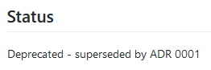

# Add Status Field

## Context and Problem Statement

Technical Story: <https://github.com/adr/madr/issues/2>

ADRs have a status. Should this be tracked? And if it should, how should we track it?

## Considered Options

* Use YAML front matter
* Use badge
* Use text line
* Use separate heading
* Use table
* Do not add status

## Decision Outcome

Chosen option: "Use YAML front matter", because comes out best (see below).

## Pros and Cons of the Options

### Use YAML front matter

Example:

```markdown
---
parent: Decisions
nav_order: 3
status: on hold
---
# Write own MADR tooling
```

* Good, because YAML front matter is supported by most Markdown parsers

### Use badge

#### Examples

* 
* [](https://github.com/adr/madr/blob/develop/docs/decisions/0001-use-CC0-or-MIT-as-license.md)

---

* Good, because plain markdown
* Good, because looks good
* Bad, because hard to read in markdown source
* Bad, because relies on the online service <https://shields.io> or [local badges have to be generated](https://github.com/badges/shields#using-the-badge-library)
* Bad, because at local usages, many badges have to be generated (superseeded-by-ADR-0006, for each ADR number)
* Bad, because not easy to write

### Use text line

Example: `Status: Accepted`

* Good, because plain markdown
* Good, because easy to read
* Good, because easy to write
* Good, because looks OK in both markdown-source (MD) and in rendered versions (HTML, PDF)
* Good, because no dependencies on external tools
* Good, because single line indicates the current state
* Bad, because "Status" line needs to be maintained
* Bad, because uses space at the beginning. When users read MADR, they should directly dive into the context and problem and not into the status

### Use separate heading

Example: 

* Good, because plain markdown
* Good, because easy to write
* Bad, because it uses much space: At least three lines: heading, status, separating empty line

### Use table

Example: 

* Good, because history can be included
* Good, because multiple entries can be made
* Good, because already implemented in `adr-tools` fork
* Bad, because not covered by the [CommonMark specification 0.28 (2017-08-01)](http://spec.commonmark.org/0.28/)
* Bad, because hard to read
* Bad, because outdated entries cannot be easily identified
* Bad, because needs more markdown training

### Do not add status

* Good, because MADR is kept lean
* Bad, because users demand state field
* Bad, because not in line with other ADR templates

## More Information

See [ADR-0013](0013-use-yaml-front-matter-for-meta-data.md) for more reasoning on using YAML front matter.
