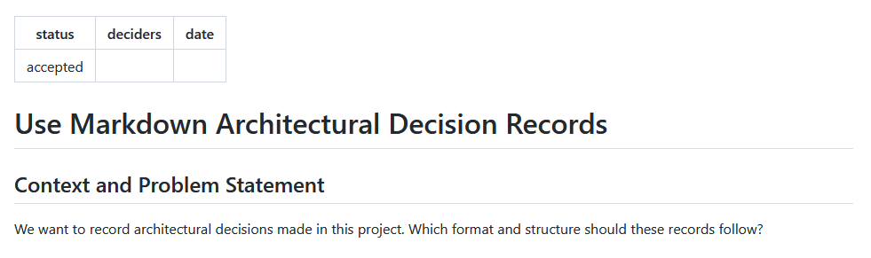

# Use YAML front matter for meta data

## Context and Problem Statement

MADR offers the fields "Status", "Deciders", and "Date".
These are a kind of meta data fields.
Should this data be included in the ADR directly or should it be separated somehow?

## Decision Drivers

* Easy to read
* Easy to write

## Considered Options

* Use YAML front matter
* Use plain markdown everywhere

## Decision Outcome

Chosen option: "Use YAML front matter", because comes out best (see below).

## Pros and Cons of the Options

## Use YAML front matter

Example:

```markdown
---
layout: page
status: accepted
adr: "0000"
title: Use Markdown Architectural Decision Records
deciders:
date:
---

## Context and problem statement

We want to record architectural decisions made in this project.
Which format and structure should these records follow?
```

Rendered output:



* Good, because it shortens the body (essence of the ADR)
* Good, because tools can handle it more easily
* Good, because indicates the lower importance of the data
* Bad, because pretends to be more accurate than it can be (e.g., possible status values)
* Bad, because rendering not standardized
* Bad, because not all Markdown parsers can parse it

## Use plain markdown everywhere

* Good, because all parsers can handle it
* Bad, because special markdown parsing tooling is needed
* Bad, because meta data is handled the same way as the content

<!-- markdownlint-disable-file MD013 -->
